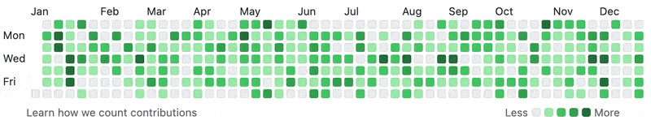

# 🚀 GitHub Contribution Booster

> **Recruiters complain about an empty GitHub profile? Problem solved!** 🎯

This magical script fills your GitHub contribution grid and transforms your "casual" developer profile into that of an obsessive coder - **without writing a single line of useful code**!



## 💪 Why use this script?

* 💬 *"Wow, you even code on weekends!"*  
  → While you were watching Netflix

* 👨‍💻 *"Impressive, your consistency on this project!"*  
  → The script ran for 3 minutes

* 🔥 *"Such passion for coding!"*  
  → The only passion was making this script work

* ✨ *"You can feel the experience in your GitHub history"*  
  → The experience of finding this repo

## 🛠️ How to use it

1. **Clone** this repo
2. **Create** an empty repository on GitHub
3. **Run** the script: 
   ```bash
   chmod +x contribution-booster.sh && ./contribution-booster.sh
   ```
4. **Follow** the instructions and provide your repo's URL (HTTPS or SSH)
5. **Admire** your new "passionate" developer profile!

## ✨ Features

* **Enhanced realism**  
  * Natural commit distribution with calm days and activity peaks  
  * Simulation of real work pace

* **Smart behavior**  
  * Fewer commits on weekends, more during the week  
  * Variation depending on days and periods

* **Customization**  
  * Adjustable periods (3 months, 6 months, last year, custom dates)  
  * Intensity levels adapted to your profile

## ⚠️ Warning

> **This script is provided for humorous purposes.**

Using it before a job interview could lead to embarrassing questions like:
- *"Tell me about that project you worked on every day for 6 months"*
- *"I noticed you made 12 commits on Christmas day..."*

## 🗑️ Remove fake contributions

If you want to erase these contributions from your profile, it's simple:
- Delete the repository on GitHub
- Contributions will automatically disappear from your profile

## 📊 Credibility levels

| Level | Profile | Commits |
|-------|---------|---------|
| **1** | "I'm new to programming" | 1-5 commits/day |
| **2** | "I'm a serious developer" | 1-15 commits/day with occasional peaks |
| **3** | "I gave up my social life for GitHub" | 3-25 commits/day |
| **4** | "I don't sleep anymore" | Up to 60 commits/day ⚠️ |

## 📜 License

Free to use - *Recruiters hate this simple trick!*